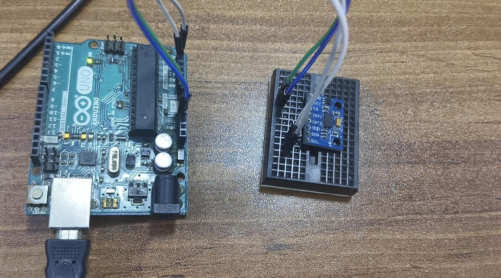
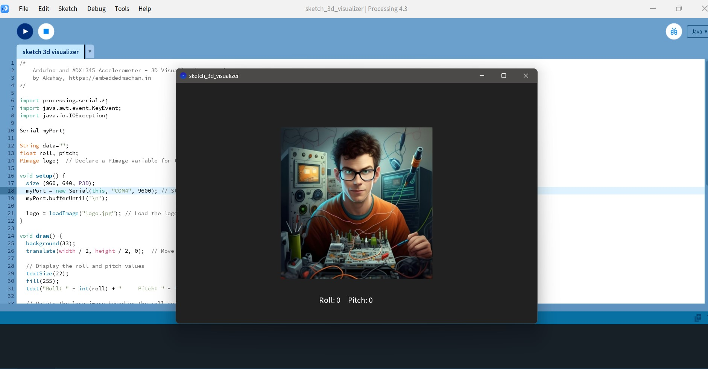

# ADXL345 Accelerometer - 3D Visualization Project

This project demonstrates how to use the **ADXL345 accelerometer** with an Arduino Uno to visualize roll and pitch angles in 3D using **Processing**. The accelerometer data is sent from the Arduino to Processing via serial communication, and a logo is rotated based on the calculated roll and pitch angles.

## Components

- Arduino Uno
- ADXL345 Accelerometer
- Jumper Wires
- Processing IDE (for visualization)
- Arduino IDE (for programming the Arduino)
- Serial communication over USB

## Features

- Real-time 3D visualization of accelerometer data.
- Roll and pitch angles calculated using raw accelerometer data.
- Visualization using a rotating image that simulates orientation changes.

## Hardware Connections

| ADXL345 Pin | Arduino Pin |
|-------------|-------------|
| VCC         | 3.3V        |
| GND         | GND         |
| SDA         | A4 (SDA)    |
| SCL         | A5 (SCL)    |

## Arduino Code

The Arduino code reads accelerometer data from the ADXL345, calculates roll and pitch, applies a low-pass filter, and sends the data via serial communication to Processing.

1. **Wire your ADXL345 to the Arduino** as per the connection table above.
2. Load the following Arduino code to your Arduino Uno:
   ```cpp
   #include <Wire.h>
   int ADXL345 = 0x53; 
   float X_out, Y_out, Z_out;
   float roll, pitch, rollF = 0, pitchF = 0;

   void setup() {
     Serial.begin(9600);
     Wire.begin();
     Wire.beginTransmission(ADXL345);
     Wire.write(0x2D);
     Wire.write(8);
     Wire.endTransmission();
     delay(10);

     Wire.beginTransmission(ADXL345);
     Wire.write(0x1E);
     Wire.write(1);
     Wire.endTransmission();
     delay(10);
     
     Wire.beginTransmission(ADXL345);
     Wire.write(0x1F);
     Wire.write(-2);
     Wire.endTransmission();
     delay(10);

     Wire.beginTransmission(ADXL345);
     Wire.write(0x20);
     Wire.write(-9);
     Wire.endTransmission();
     delay(10);
   }

   void loop() {
     Wire.beginTransmission(ADXL345);
     Wire.write(0x32);
     Wire.endTransmission(false);
     Wire.requestFrom(ADXL345, 6, true);

     X_out = ( Wire.read() | Wire.read() << 8) / 256;
     Y_out = ( Wire.read() | Wire.read() << 8) / 256;
     Z_out = ( Wire.read() | Wire.read() << 8) / 256;

     roll = atan(Y_out / sqrt(pow(X_out, 2) + pow(Z_out, 2))) * 180 / PI;
     pitch = atan(-1 * X_out / sqrt(pow(Y_out, 2) + pow(Z_out, 2))) * 180 / PI;

     rollF = 0.94 * rollF + 0.06 * roll;
     pitchF = 0.94 * pitchF + 0.06 * pitch;

     Serial.print(rollF);
     Serial.print("/");
     Serial.println(pitchF);

     delay(100);
   }```


## Processing Code

```
/*
    Arduino and ADXL345 Accelerometer - 3D Visualization Example 
    by Akshay , https://embeddedmachan.in
*/

import processing.serial.*;
import java.awt.event.KeyEvent;
import java.io.IOException;

Serial myPort;

String data="";
float roll, pitch;
PImage logo;  // Declare a PImage variable for the logo

void setup() {
  size (960, 640, P3D);
  myPort = new Serial(this, "COM1", 9600); // Start serial communication
  myPort.bufferUntil('\n');
  
  logo = loadImage("logo.jpg"); // Load the logo image
}

void draw() {
  background(33);
  translate(width / 2, height / 2, 0);  // Move the origin to the center of the screen
  
  // Display the roll and pitch values
  textSize(22);
  fill(255);
  text("Roll: " + int(roll) + "     Pitch: " + int(pitch), -100, 265);

  // Rotate the logo image based on the roll and pitch values
  rotateX(radians(roll));
  rotateZ(radians(-pitch));
  
  // Display the rotating logo image
  imageMode(CENTER);  // Center the image
  image(logo, 0, 0, logo.width / 2, logo.height / 2);  // Adjust size and position
  
  //delay(10);
  //println("ypr:\t" + angleX + "\t" + angleY); // Print the values to check whether we are getting proper values
}

// Read data from the Serial Port
void serialEvent (Serial myPort) { 
  // Read the data from the Serial Port
  data = myPort.readStringUntil('\n');

  // If data is received
  if (data != null) {
    data = trim(data);
    // Split the string at "/"
    String items[] = split(data, '/');
    if (items.length > 1) {
      // Parse the roll and pitch values from the serial data
      roll = float(items[0]);
      pitch = float(items[1]);
    }
  }
}
```

## Circuit Image

Here is the circuit image for the project:




## UI Screen

Here is the output ui (Processing) for the project:

